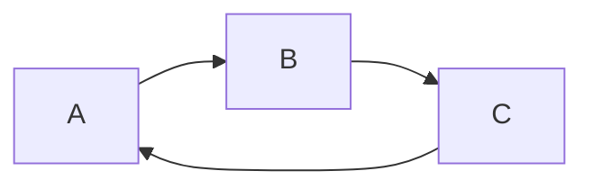

# First
The first Repository
For gene differential analysis
It is fun.
title: hi

##  sure

zheshi 

👍

![GitHub Logo]

1.嗯嗯

1.
    1.**zheshi**


```sequence {theme="hand"}
Andrew->China: Says Hello
Note right of China: China thinks\nabout it
China-->Andrew: How are you?
Andrew->>China: I am good thanks
```

